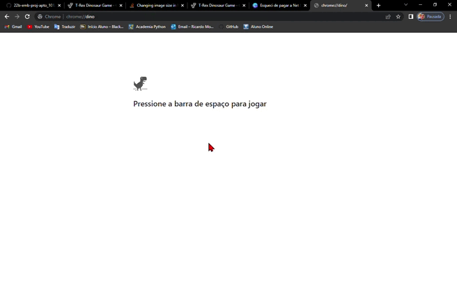
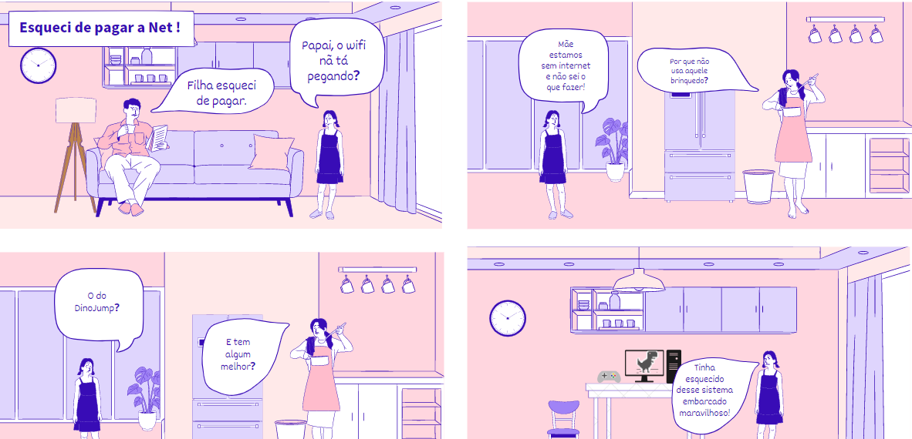
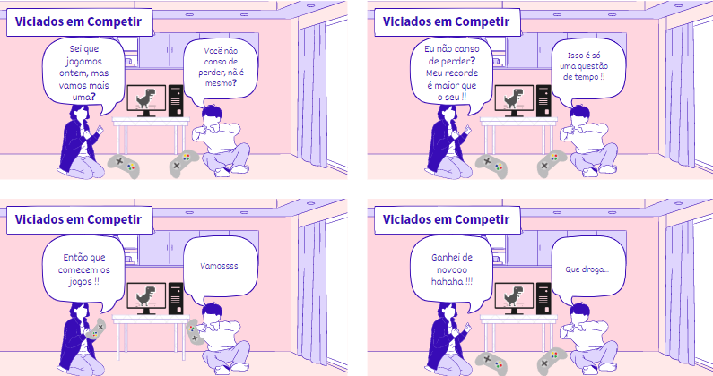
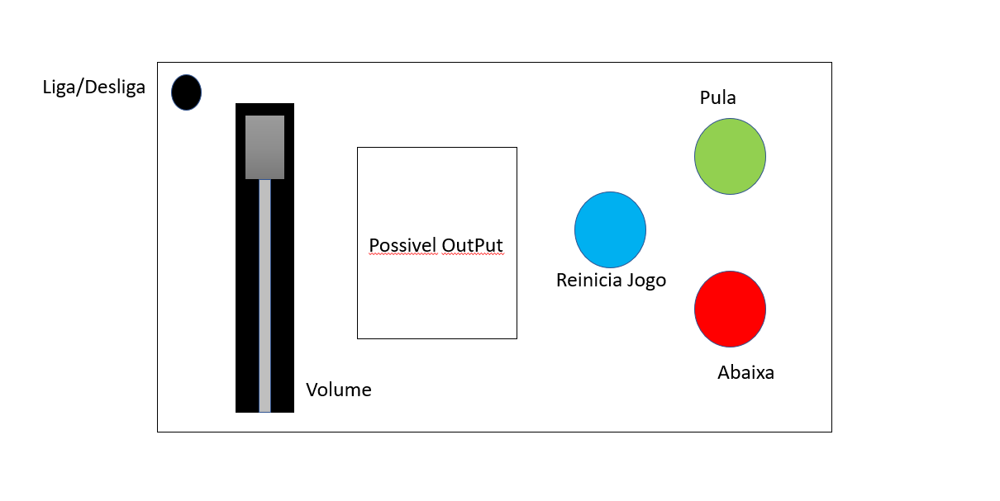

# Projeto Embarcados

Desenvolvendo um controle remoto.

## Entrega 1

### Integrantes

- Adney Costa Moura
- Ricardo Mourão Rodrigues Filho

### Ideia

Criar o controle para controlar o dinossauro do chrome.  
Link da aplicação: https://chromedino.com/ ou chrome://dino/

### Nome

DinoJump

### Usuários 

Este sistema embarcado consiste em ajudar usuários sem internet ou entediados. Foi escolhido o jogo do dino ("famoso jogo dos sem wifi"). Sendo assim, o usuário pode se debruçar na aplicação, consequentemente, trazendo o seu dia menos CHATO!  

### Software/Jogo 

O controle servirá para guiar o dinossauro.

### Jornada do usuários (3 pts)
#### Jornada 1

#### Jornada 2

### Comandos/ Feedbacks (2 pts)

Comandos:

- Botão para pular (Digital)
- Botão para abaixar (Digital)
- Botão para iniciar/reiniciar a aplicação (Digital)
- Botão para ligar/desligar o controle embarcado (Digital)
- Controle de som do computador (Analógico)

Feedbacks:

- Tela para mostrar pontuação do jogador e volume.
- Led de ON / OFF

## In/OUT (3 pts)

|    Botão      |      Pino     |
| ------------- | ------------- |
| Verde  | PA6  |
| Azul  | PC19  |
| Vermelho  | PA2  |
| Liga/Desliga  | PA3  |

- Botão para pular (Digital) - verde:
  - Usuário clica e o dino pula, acendendo o led para identificação.
- Botão para abaixar (Digital) - vermelho:
  - Usuário clica e o dino abaixa, acendendo o led(cor diferente) para identificação
- Botão para iniciar/reiniciar a aplicação (Digital)  - azul
  - Usuário clica e volta a jogar o DinoJump.
- Botão para ligar/desligar o controle embarcado (Digital) - preto
  - Quando energizado procura por um aparelho para se conectar
  - Caso o usuário aperte o botão de ligar/desligar, o controle desconecta do aparelho conectado e entra em estado de economia de energia
  - Quando ligado novamente, ele procura outro dispositivo para se conectar.
- Controle de som do computador (Analógico)
  - Usuário resolve aumentar ou diminuir o volume da aplicação, aparecendo o vlume no output.
  
### Design (2 pts)

Sujeito a alteração.

